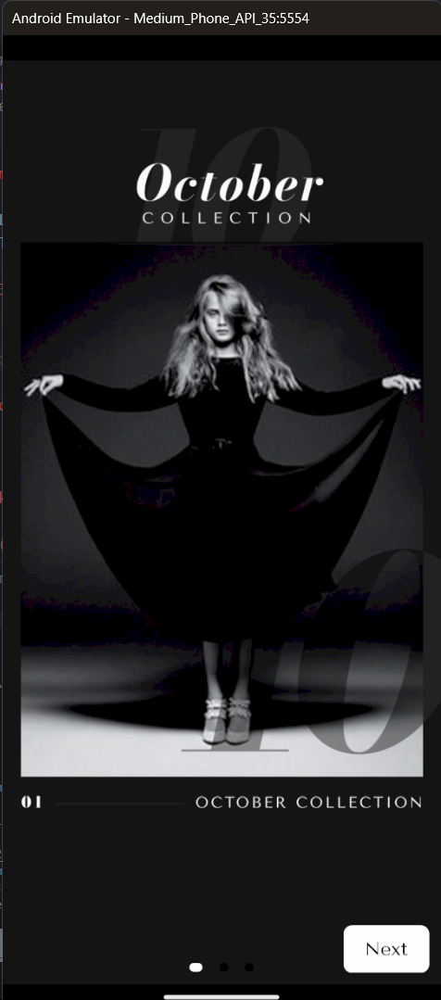
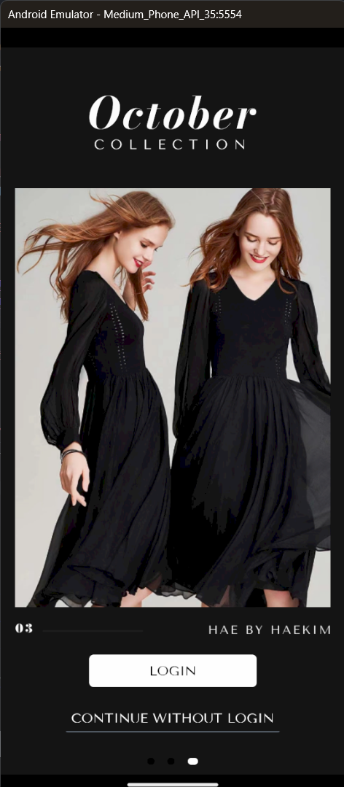
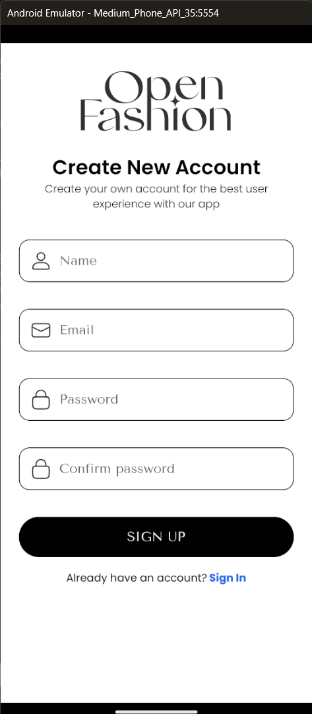
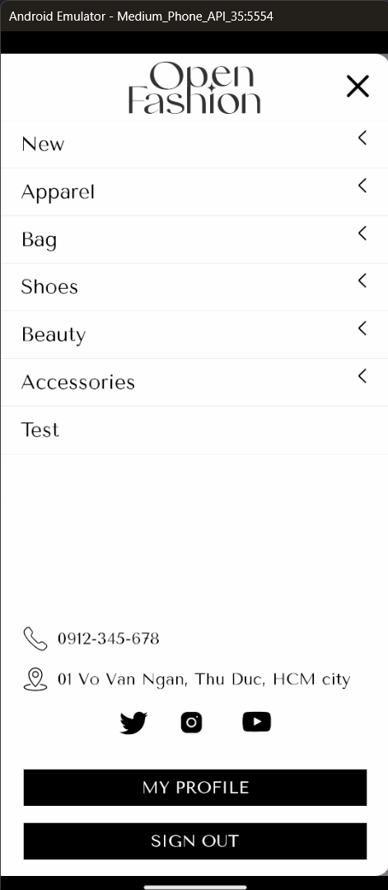

# Bài tập lớn

## Github nhóm:

- 21110359 - Lê Xuân Bách
- 21110847 - Trần Quốc Phương

## Bài tập A03: Xây dựng app bán đồ thời trang

## UI

## Usecases
### đăng kí có OTP qua mail (client)

### đăng nhập (client)

### quên mật khẩu (client)

### giỏ hàng (client)

### thanh toán (client)

###  đánh giá sản phẩm đã mua (client)

### profile (client)

### báo cáo doanh thu (admin)

### quản lý sản phẩm shop (admin)

###  quản lý khuyến mãi giảm giá (admin)

### quản lý đơn hàng shop (admin)
